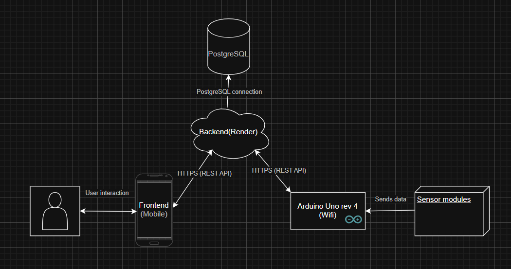

# **Project architecture**

## Architecture diagram - flowchart:

## Architecture diagram for IoT:

## Detailed explanations:

For a more in-depth explanation of the different aspects of the project and their functionalities, please visit the following pages: 
- [IoT/Hardware](../../IoT/)
- [Backend](../../backend/)
- [Frontend-mobile](../../frontend-mobile/)

You can find the draw.io file for the diagrams in the same folder. *note: You may be required to download the draw.io extension for Visual Studio Code or similar and clone this repo to view the file*