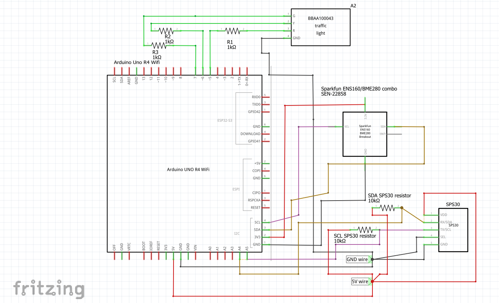

# Kretsschema och fysisk koppling

## Inledning

I detta dokument hittar du kopplingsschema och hur du fysisk kopplar ihop de olika komponenterna för att få en fungerande produkt.

## Kretsschema

### snabb-översikt

De olika färgerna i kopplingsschemat representerar olika egenskaper och vad de ansluter till.
- **Röd:** VCC
- **Svart:** GND
- **Grön:** Digital pins.
- **Lila:** SCL
- **Brun:** SDA

## Fysisk koppling 

*Note: SPS30 i denna bild är enbart en mock-up för att visa kopplingen.*
